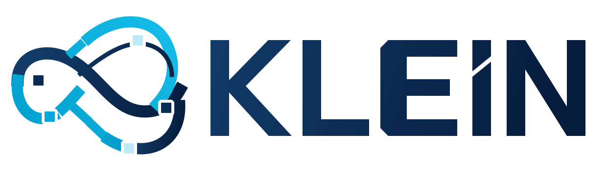
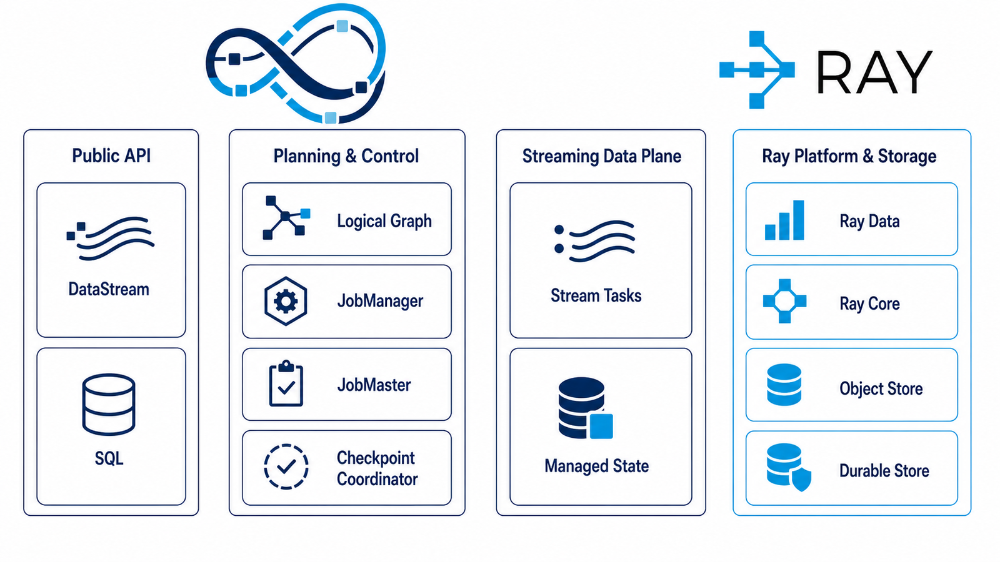

<!-- SPDX-License-Identifier: Apache-2.0 -->

<p align="center">
  <picture>
    <source media="(prefers-color-scheme: dark)" srcset="docs/_static/klein-logo-dark.svg">
    
  </picture>
</p>

<p align="center"><strong>Stateful stream processing on Ray.</strong></p>

<p align="center">
  <a href="https://github.com/yuchen-ecnu/klein/actions/workflows/ci.yml"></a>
  
  
  
  <a href="LICENSE"></a>
</p>

Klein for Ray is a stateful stream-processing library built on Ray. A single
`DataStream` API handles bounded Ray Data inputs and long-running streams, with
event time, managed keyed state, checkpoint recovery, and SQL and Table APIs.

> [!WARNING]
> Klein for Ray is independent alpha software. It is not affiliated with,
> endorsed by, or maintained by the Ray project. The `ray.klein` namespace is
> retained as a technical integration point, not as a claim of official status.

## Why Klein for Ray?

Klein is for Ray applications that need record-oriented processing and state
that survives task failures or parallelism changes. Use
[Ray Data](https://docs.ray.io/en/latest/data/data.html) directly for bounded
data preparation, inference, or training ingest that does not need streaming
state or event-time progress.

### Name and mark

“Klein” comes from the Klein bottle and the idea of taking a Möbius loop one
dimension further. The mark turns the bottle's continuous, self-crossing
surface into a data stream; square waypoints preserve the distributed-node
language shared by Ray's data products without claiming official project
status.

| Capability | What Klein provides |
| --- | --- |
| Unified dataflows | One lazy `DataStream` graph for bounded and continuous sources. |
| Native Ray execution | Ray Data lowers bounded work; Ray Core runs long-lived streaming operators. |
| Event time | Watermarks, idle-input detection, windows, and event-time timers. |
| Managed state | Keyed state, TTL, key groups, rescaling, and checkpoint restore. |
| Recovery | Durable checkpoints, source-position restore, and replay-aware sinks. |
| Relational APIs | Bounded SQL plus dynamic tables and explicit changelog rows for continuous queries. |
| Connectors | Ray Data, collections, Kafka, RocketMQ, filesystems, Redis, console, custom connectors, and Ray Serve integration. |
| Operations | Structured logs, Ray metrics, checkpoint inspection, CLI attach, and a JSON-safe state API. |

### How Klein fits into Ray

| Ray component | Role in Klein |
| --- | --- |
| Ray Core | Runs distributed operators and coordinates streaming recovery. |
| Ray Data | Executes bounded sources, transformations, shuffles, and sinks. |
| Ray Object Store | Shares immutable checkpoint fragments to accelerate recovery. |



The same lazy graph therefore has two execution paths: bounded-compatible work
lowers to Ray Data, while continuous work expands into long-lived Ray actors.
The streaming control plane stays outside the record path; workers exchange
ordered micro-batches directly and use durable checkpoints for cluster-loss
recovery. See the [architecture guide](docs/architecture.md) for the planning,
data-plane, checkpoint, and extension boundaries behind this overview.

The distribution contributes only the `ray.klein` namespace package. It does
not install `ray/__init__.py` or replace files owned by Ray.

## Installation

Klein for Ray currently targets Python 3.10–3.12 and Ray 2.56.1. Install the
Alpha release from PyPI:

```bash
python -m venv .venv
source .venv/bin/activate
python -m pip install --upgrade pip
python -m pip install "ray-klein==0.1.0a1"
```

Install connector dependencies only when needed:

```bash
python -m pip install "ray-klein[kafka]==0.1.0a1"   # continuous Kafka source/sink
python -m pip install "ray-klein[rocketmq]==0.1.0a1" # continuous RocketMQ source
python -m pip install "ray-klein[redis]==0.1.0a1"   # Redis lookup/sink
python -m pip install "ray-klein[rocksdb]==0.1.0a1" # local RocksDB state backend
python -m pip install "ray-klein[serve]==0.1.0a1"   # Ray Serve bridge
```

For development, clone the repository and install the test, documentation, and
tooling dependencies:

```bash
git clone https://github.com/yuchen-ecnu/klein.git
cd klein
python -m pip install -e ".[dev]"
pre-commit install
```

## Quick start

Interactive mode executes this bounded graph when `take_all()` is called:

```python
import ray

ray.klein.reset_context().enable_interactive_mode()

rows = (
    ray.klein.from_items(
        [
            {"name": "Ada", "amount": 4},
            {"name": "Grace", "amount": 7},
        ]
    )
    .map(lambda row: {**row, "amount": row["amount"] * 2})
    .take_all()
)

print(rows)
```

```text
[{'name': 'Ada', 'amount': 8}, {'name': 'Grace', 'amount': 14}]
```

Source construction follows `ray.data`: for example,
`ray.klein.read_parquet(...)` creates a bounded stream using the installed Ray
Data reader. Native methods such as `stream.map(...)` use Klein semantics;
`stream.data.map(...)` delegates to the installed Ray Data implementation.

For continuous execution, see the
[Kafka walkthrough](docs/getting-started.md#submit-a-dataflow) and the complete
[connector catalog](docs/connectors/index.md).

Klein jobs appear directly in Ray Dashboard under `/#/klein`. A local Ray
Dashboard uses `http://127.0.0.1:8265/#/klein` by default.

## Documentation

| Start here | What it covers |
| --- | --- |
| [Getting started](docs/getting-started.md) | Installation, bounded pipelines, streaming submission, and configuration. |
| [Key concepts](docs/key-concepts.md) | Execution modes, state, event time, and recovery. |
| [Architecture](docs/architecture.md) | Planning, batch and streaming runtimes, the ordered data plane, checkpoints, recovery, and extension boundaries. |
| [User guides](docs/user-guides.md) | Production streaming, SQL, state, delivery semantics, recovery, deployment, tuning, and operations. |
| [Operator compatibility](docs/operator-compatibility.md) | Batch/streaming support, partitioning, state, changelog, and sink behavior. |
| [Production walkthrough](docs/production-streaming.md) | Kafka input through event-time state, checkpoints, file output, CLI operations, and restore. |
| [Connector catalog](docs/connectors/index.md) | Every connector's modes, options, defaults, schemas, and guarantees. |
| [Configuration reference](docs/configuration-reference.md) | Every supported key, type, default, constraint, and environment variable. |
| [API reference](docs/api/api.rst) | Public Python classes, functions, and methods. |
| [Observability](docs/observability.md) | Logs, metrics, checkpoints, CLI attach, and the native Ray Dashboard integration. |
| [Troubleshooting](docs/troubleshooting.md) | Installation, planning, connector, watermark, checkpoint, backpressure, and CLI failures. |

Build the documentation locally with:

```bash
make docs
```

## Compatibility and stability

The public API is still evolving and may change before 1.0. Klein pins one
tested Ray minor release because some Ray Data extension points are Developer
APIs; read the [compatibility policy](docs/compatibility.md) before changing the
Ray dependency range.

`state.keyed.max-parallelism` is part of checkpoint compatibility. Do not
change it after a job creates checkpoints that must remain restorable.

## Contributing and support

Contributions are welcome. Read [CONTRIBUTING.md](CONTRIBUTING.md) for setup,
test tiers, sign-off, and pull request requirements. For help, use the channels
in [SUPPORT.md](SUPPORT.md); report vulnerabilities privately as described in
[SECURITY.md](SECURITY.md).

Project decisions follow [GOVERNANCE.md](GOVERNANCE.md), releases are recorded
in [CHANGELOG.md](CHANGELOG.md), and research users can cite the metadata in
[CITATION.cff](CITATION.cff).

## License

Klein for Ray is licensed under the [Apache License 2.0](LICENSE). See
[NOTICE](NOTICE), [PROVENANCE.md](PROVENANCE.md), and
[TRADEMARKS.md](TRADEMARKS.md) for attribution and project identity.
