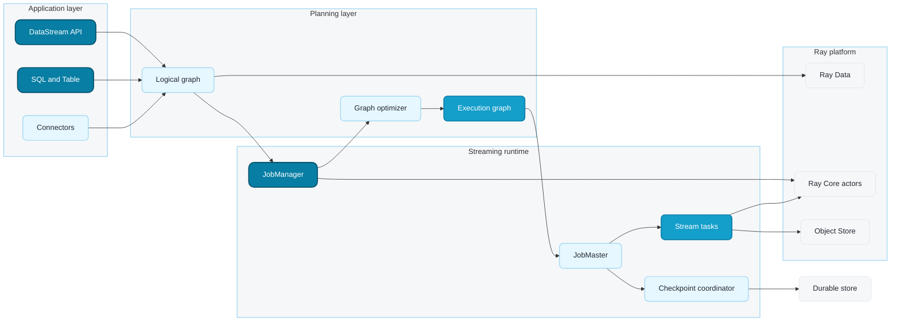
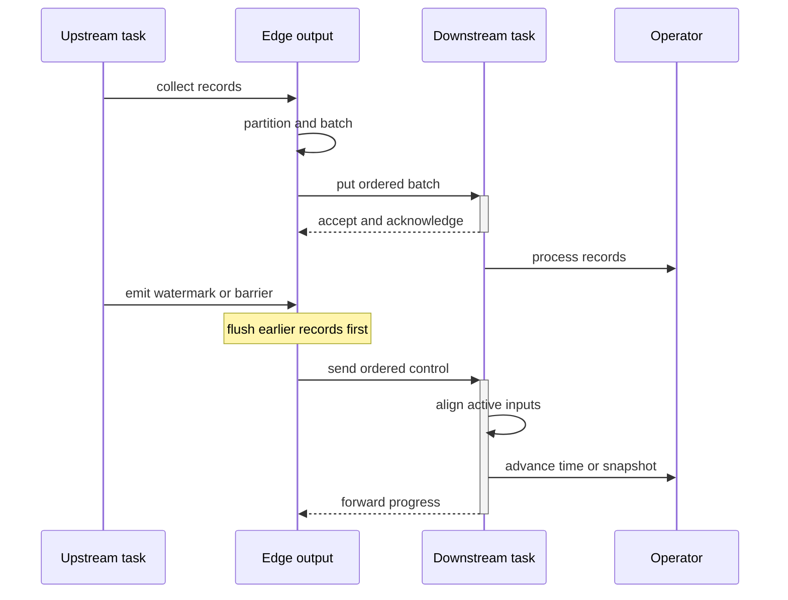
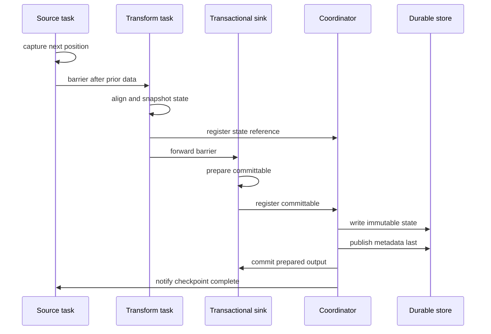

---
myst:
  html_meta:
    description: "Understand the Klein for Ray architecture, planning pipeline, streaming data plane, checkpoint protocol, and extension boundaries."
---
<!-- SPDX-License-Identifier: Apache-2.0 -->

(klein-architecture)=
# Architecture

Klein separates the user-facing dataflow from the engine that executes it. A
`DataStream`, SQL statement, or Table program first creates a lazy logical
graph. Only a terminal operation asks `JobClient` to select a runtime and turn
that graph into work on Ray.

This separation keeps three concerns independent:

- the **API and logical plan** describe what the application wants;
- the **control plane** plans, deploys, checkpoints, and recovers a job; and
- the **data plane** moves ordered records and control messages through
  parallel operators.

## System overview

Read the diagram from left to right:

1. Public APIs and connectors create operator and edge specifications; they do
   not start Ray work immediately.
2. `JobClient` validates the directed acyclic graph and rewrites regions such
   as Ray Serve before selecting a runtime.
3. Bounded-compatible graphs compile to Ray Data. For streaming graphs, the
   `JobManager` applies union and operator-chaining rules and expands each
   logical operator into parallel physical subtasks.
4. Ray Core hosts the detached job control plane and long-lived stream tasks.
   The Ray Object Store can cache immutable state snapshots, but durable
   checkpoint storage remains the cluster-loss recovery boundary.

## Plan once, choose one runtime

`KleinContext.execute()` hands its sink roots to `JobClient`. `JobClient`
walks upstream from those sinks to create one immutable `LogicalGraph`, applies
an optional Ray Serve rewrite and resource plan, and then selects a backend.

```mermaid
%%{init: {
  'theme': 'base',
  'themeVariables': {
    'primaryColor': '#087EA4',
    'primaryTextColor': '#FFFFFF',
    'primaryBorderColor': '#044E68',
    'secondaryColor': '#E6F7FF',
    'secondaryTextColor': '#23272F',
    'secondaryBorderColor': '#99D6F0',
    'tertiaryColor': '#F6F7F9',
    'tertiaryTextColor': '#23272F',
    'tertiaryBorderColor': '#E0E3E8',
    'lineColor': '#99A1B3',
    'textColor': '#23272F',
    'fontSize': '13px',
    'fontFamily': '"JetBrains Mono", "Fira Code", monospace'
  },
  'flowchart': {
    'nodeSpacing': 30,
    'rankSpacing': 50,
    'padding': 15,
    'wrappingWidth': 120
  }
}}%%
flowchart LR
    classDef primary fill:#087EA4,stroke:#044E68,color:#FFFFFF,stroke-width:2px,rx:12,ry:12
    classDef secondary fill:#E6F7FF,stroke:#99D6F0,color:#23272F,stroke-width:1.5px,rx:8,ry:8
    classDef accent fill:#149ECA,stroke:#0D7EA8,color:#FFFFFF,stroke-width:2px,rx:8,ry:8
    classDef decision fill:#F6F7F9,stroke:#087EA4,color:#23272F,stroke-width:2px

    Sink[Sink roots]:::primary --> Logical[Logical graph]:::secondary
    Logical --> Rewrite[Plan rewrites]:::secondary
    Rewrite --> Mode{Runtime?}:::decision
    Mode -->|bounded| Batch[Batch compiler]:::accent
    Batch --> Data[Ray Data DAG]:::primary
    Mode -->|continuous| Optimize[Graph optimizer]:::accent
    Optimize --> Expand[Physical subtasks]:::secondary
    Expand --> Actors[Ray actors]:::primary
```

In `auto` mode, an unbounded source or an operation without a Ray Data
lowering selects streaming execution. Otherwise the graph uses the batch
compiler. An explicit `execution.runtime.mode` overrides this choice, but the
selected backend must support every operation in the graph.

The logical and physical plans have different jobs:

| Plan | Contains | Stability |
| --- | --- | --- |
| `LogicalGraph` | Operator specifications, logical edges, partitioner specifications, boundedness, resources, and stable names. | Immutable after construction; optimizer rules return a new graph. |
| `ExecutionGraph` | Parallel `ExecutionVertex` subtasks, physical channels, barrier-alignment counts, and placement affinity groups. | Topology is fixed after expansion; runtime status is owned by the scheduler. |

## Streaming control plane

Every streaming job receives its own Ray namespace. The namespace prevents
named actors for sibling jobs from resolving to one another and is also the
identifier used by CLI attachment and dashboard publication.

| Component | Responsibility |
| --- | --- |
| `JobClient` | Creates the logical graph, selects the runtime, initializes Ray only when streaming needs it, and returns a job handle. |
| `JobManager` | Detached per-job Ray actor; supervises status and failover, serializes execution-graph mutations, and keeps the job alive when the submitting driver exits. |
| `JobMaster` | Single owner of scheduling state; creates workers, deploys descriptors, manages placement, and coordinates task or global recovery. |
| `CheckpointCoordinator` | Aligns checkpoint registrations, publishes durable metadata, commits prepared sinks, notifies checkpoint-aware sources, and exposes checkpoint state. |
| `StreamTask` | Ray actor for one physical operator subtask. A `SourceStreamTask` additionally owns source polling, source progress, and barrier generation. |

The control plane is deliberately small. It sends deployment, status,
checkpoint, and recovery commands; it does not proxy every data record.

## Ordered streaming data plane

Workers communicate directly. Each output edge owns partitioning, batching,
transport, replay tracking, and backpressure. Data and control share the same
ordered channel, so a watermark or checkpoint barrier cannot pass records that
were emitted before it.

Inside a task, a weighted inbox bounds both rows and bytes. An input
accumulator restores logical batches, the operator runs on a single-worker
executor, and an emit pipeline preserves output order. Async operators may run
multiple calls concurrently, but `AsyncOrderedRunner` releases their results
in input order. When a target inbox is full, the sender waits or probes another
eligible target according to the partitioner; those waits are the
backpressure mechanism.

Partitioners define channel topology:

- **forward** keeps subtask index-to-index routing and can drive co-location;
- **key** maps stable key groups to the task that owns their contiguous range;
- **round-robin, rescale, and adaptive** distribute work among eligible tasks;
- **broadcast** sends a record to every target; and
- **worker-pool dispatch** can retry admission across an ordered target ring.

## Checkpoint and recovery architecture

A checkpoint is an ordered protocol across the data plane, state backends,
external sinks, and durable storage. The completion marker is published last,
so recovery never treats a partially written directory as complete.

Managed state can use an in-memory or RocksDB task-local backend. Snapshots are
split by key group so a restored operator can change parallelism without
changing key ownership semantics. Large immutable snapshots may remain in the
Ray Object Store as a hot cache; the coordinator also persists verified state
objects and metadata to the configured filesystem or object store.

Recovery is tiered:

1. A single failed task can be recreated and replay unacknowledged upstream
   batches when the affected topology is recoverable.
2. A rebuilt checkpoint coordinator is reopened from the live execution graph.
3. An unrecoverable task failure triggers a global stop and reschedule from the
   latest completed checkpoint, subject to the restart suppression policy.
4. After whole-cluster loss, an application resubmits the same logical graph
   with `execution.savepoint.path` pointing at one completed checkpoint.

This protocol provides consistent managed state and source progress. The
end-to-end job contract remains at-least-once unless the selected sink provides
checkpoint-transactional visibility or an idempotent external effect. See
[Delivery and consistency guarantees](delivery-semantics.md) and
[Restore and rescale a job](checkpoint-recovery.md).

## Extension boundaries

Add behavior at the narrowest public boundary that owns it:

| Extension | Public boundary | Avoid coupling to |
| --- | --- | --- |
| Source | `SourceFunction` and `SourceContext` | scheduler, execution vertices, or actor handles |
| Transformation | `DataStream` operation or public function contract | transport, inbox, or checkpoint coordinator internals |
| Sink | `SinkFunction` or `TwoPhaseCommitSinkFunction` | checkpoint metadata layout |
| Partitioning | public stream partitioning operation | target actor discovery |
| State | state descriptors and keyed process functions | backend serialization internals |
| Connector | `integrations` package using API/config contracts | unrelated runtime packages |
| Observability | metric groups, lineage, job snapshots, and state API | mutating the execution graph |

The source layout and dependency rules are documented in
[Package structure](package-structure.md). `_internal` and `runtime` are
implementation packages rather than application compatibility promises.
