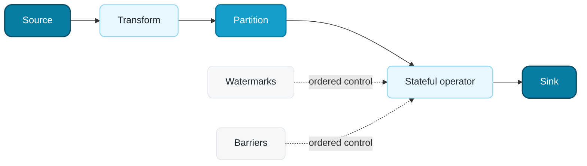

---
myst:
  html_meta:
    description: "Learn the Klein for Ray execution model, DataStream abstraction, keyed state, event time, and checkpoint recovery."
---
<!-- SPDX-License-Identifier: Apache-2.0 -->

(klein-key-concepts)=
# Key concepts

Klein for Ray represents a pipeline as a lazy dataflow graph. Sources produce records, transformations create new streams, partitioners route data, and sinks trigger execution.

The solid path is the record flow. Partitioning determines which physical task
receives each record. Watermarks and checkpoint barriers use the same ordered
edges, so they describe all records that precede them. The
[architecture guide](architecture.md) expands this logical view into planning,
control-plane, data-plane, and recovery components.

## What is a DataStream?

A `DataStream` is a logical collection of records and the operations needed to produce them. Methods such as `map()`, `filter()`, `key_by()`, and `join()` add operators to the graph. They don't run work when you call them.

A stream belongs to one `KleinContext`. The module-level `ray.klein` functions use a process-global context so source creation matches `ray.data`. Construct `KleinContext` directly only when one process needs isolated graph builders.

## How does Klein choose an execution mode?

In `auto` mode, Klein selects an execution mode from source boundedness and
sink capability:

- An unbounded source or a sink without a Ray Data lowering selects streaming
  execution. Klein deploys long-lived source, transform, and sink tasks on Ray.
- Otherwise Klein selects batch and lowers the graph to lazy Ray Data
  `Dataset` operations.

You can override detection through `execution.runtime.mode`. A graph must use
operations supported by its selected mode. In particular, a bounded custom
`SourceFunction` without a Ray Data lowering must explicitly select streaming;
automatic selection does not inspect bounded source lowerings.

## How does data move through a streaming graph?

Streaming tasks exchange ordered micro-batches. A partitioner chooses the downstream task for each batch or record. Control messages, including checkpoint barriers and event-time progress, use the same physical edges and flush preceding data first. This ordering prevents a barrier or watermark from overtaking earlier records.

Backpressure limits in-flight data between tasks. Ray actors provide task isolation and scheduling, while the Ray Object Store carries shared immutable values such as large checkpoint fragments.

## What is keyed state?

`key_by()` partitions records by a stable key and returns a `KeyedStream`. Stateful operators access `ValueState`, `ListState`, and `MapState` through descriptors. State descriptors can define time-to-live (TTL) behavior, and stateful functions can register processing-time or event-time timers.

Klein maps each key to a fixed key group. A task owns a contiguous range of key groups, so a restored job can change operator parallelism without rehashing its keys. The checkpoint stores state, TTL indexes, and timers by key group. `state.keyed.max-parallelism` defines the key-group space and is part of checkpoint compatibility.

See [Managed state](ray-native-state.md) for backend selection, rescaling, and timer behavior.

## What is event time?

Event time comes from timestamps in the records rather than the clock on a worker. A `Watermark(t)` states that one input doesn't expect another event at or before timestamp `t`. A multi-input operator advances to the minimum watermark across its active inputs.

An input that has not emitted its first watermark blocks progress. An idle input doesn't block progress. When data resumes, the input becomes active before the new record enters the operator. This protocol keeps windows and joins moving when a Kafka partition or another physical input has no data.

See [Event time and idle inputs](event-time.md) for watermark strategies and source connector hooks.

## How do checkpoints recover a job?

A checkpoint barrier separates records before and after a consistent state snapshot. Stateful tasks export immutable key-group fragments. Small snapshots remain inline, while large snapshots can use the Ray Object Store as a hot recovery cache. Completed checkpoints are persisted to a filesystem or object store for recovery after a cluster or coordinator loss.

Klein publishes checkpoint metadata only after every referenced state object is durable and verified. Recovery ignores incomplete checkpoint directories. See [Durable checkpoint storage](checkpoint-storage.md) for the directory layout and publication protocol.

:::{important}
Klein provides at-least-once progress semantics. A non-transactional sink can observe replayed records after recovery. Managed state and checkpoints don't turn an arbitrary sink into an exactly-once sink.
:::

## How does Klein relate to Ray Data?

Klein doesn't copy Ray Data reader or `Dataset` method signatures. `ray.klein.read_csv`, `read_parquet`, and other bounded readers resolve their installed `ray.data` functions dynamically. `stream.data` exposes compatible Dataset operations.

Use native `DataStream` methods for streaming semantics. Use `stream.data` when the operation is a bounded Ray Data operation. See [Ray Data interoperability](ray-data-interop.md) for details and the [connector catalog](connectors/index.md) for each connector's supported mode and guarantees.
